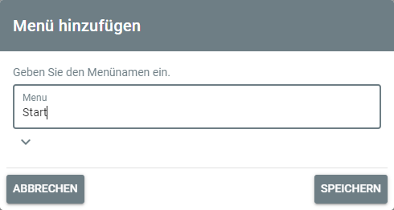
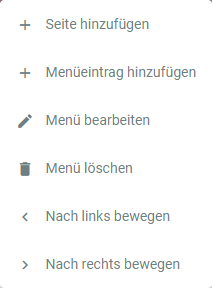

# Menus

## Menu Management

You can add menus by left-clicking on the following button in the top bar:

A dialog opens, and you can configure the menu's name and restrictions, if the menu shouldn't be available to anyone:

Additionally, you can provide a name and description for exports based on this menu.
Exports of menus contain all pages of the menu and their contained items with media files.

After adding the menu, it will be shown in the menu bar.
As long as there are no menu entries defined, or a page assigned to the menu, it will be shown in red and only to
administrators.

By right-clicking on the menu a context menu opens

which offers the following options:

| Option         | Description                                                                                                           |
|:---------------|:----------------------------------------------------------------------------------------------------------------------|
| Add Page       | Adds a page to the menu. When left-clicking the menu, the page will open directly.                                    |
| Add Entry      | Adds an entry to the menu. When left-clicking the menu, it will open and show its menu entries.                       |
| Edit Menu      | Opens the menu dialog and lets you change the menu's name or restrictions.                                            |
| Delete Menu    | Deletes the menu and all its entries and associated pages!                                                            |
| Export Content | Exports the menu's pages and their content including items with media files into the project's ``exports`` directory. |
| Move Left      | Moves the menu one step to the left.                                                                                  |
| Move Right     | Moves the menu one step to the right.                                                                                 |

## Menu Entries

Menus can have entries.
When adding an entry to a menu, the same dialog as the one for menus opens, and a menu entry name and restrictions can
be specified.

When right-clicking on an existing menu entry, a context menu opens

which offers the following options:

| Option            | Description                                                                                                        |
|:------------------|:-------------------------------------------------------------------------------------------------------------------|
| Edit Menu Entry   | Opens the menu entry dialog and lets you change the menu entry's name or restrictions.                             |
| Delete Menu Entry | Deletes the menu entry and its associated page!                                                                    |
| Export Content    | Exports the menu's page and its content including items with media files into the project's ``exports`` directory. |
| Move Up           | Moves the menu entry one step up.                                                                                  |
| Move Down         | Moves the menu one step down.                                                                                      |
