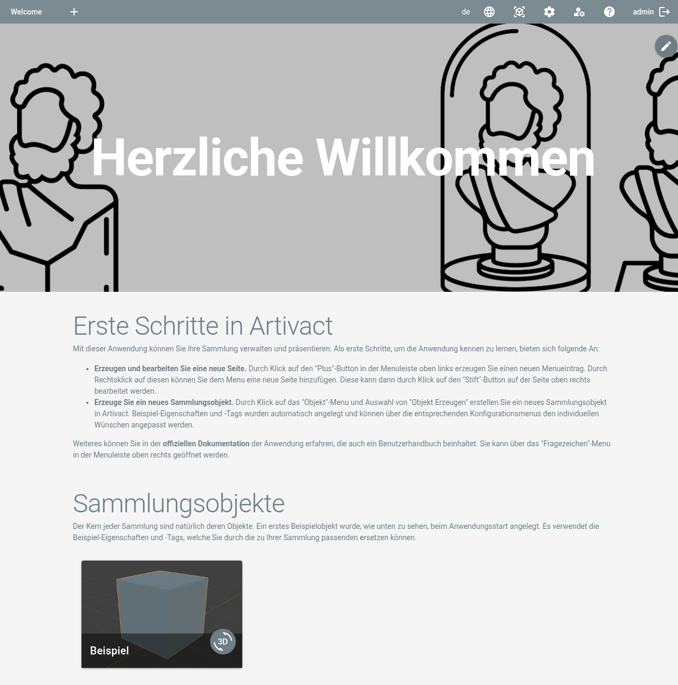

# Artivact Benutzerhandbuch

## Über

Das Artivact Benutzerhandbuch beschreibt, wie die Anwendung genutzt werden kann, um virtuelle Sammlungen zu erstellen
und zu verwalten.

Die Desktop- und Webserver-Variante der Anwendung unterscheiden sich leicht im Funktionsumfang.  
Wenn eine Funktion nur für eine der Installationsvarianten gilt, wird dies in der Dokumentation durch eines der
folgenden Badges gekennzeichnet:

- <Badge type="warning" text="server"/> – Diese Funktionalität ist nur verfügbar, wenn Artivact im Webserver-Modus betrieben wird.
- <Badge type="warning" text="desktop"/> – Diese Funktionalität ist nur verfügbar, wenn Artivact auf deinem lokalen Computer gestartet wird.

## Der Hauptbildschirm

Nach dem ersten Start wird dem Benutzer der Hauptbildschirm angezeigt.  
<Badge type="warning" text="desktop"/> Im Desktop-Modus ist dies die standardmäßige Willkommensseite.

Oben befindet sich die Navigations- und Einstellungsleiste.  
Die folgenden Funktionen stehen von links nach rechts zur Verfügung:

|                                 Button                                 | Beschreibung                                                                                                                                                         |
|:----------------------------------------------------------------------:|:---------------------------------------------------------------------------------------------------------------------------------------------------------------------|
|                  | Fügt ein neues Menü in der oberen Navigation hinzu. Siehe [Menüs](../content-management/menus) für Details.                                                          |
|  | Wählt die Sprache (Locale) für die Internationalisierung (I18N) aus. Siehe [I18N](../content-management/internationalization) für Details.                           |
|         | Öffnet das Objekte-Menü. Dort können neue Objekte erstellt oder vorhandene importiert werden. Siehe [Objektverwaltung](../item-management/introduction) für Details. |
|    | Öffnet das Menü für Systemeinstellungen. Siehe [Systemeinstellungen](../settings/properties) für Details.                                                            |
|  | <Badge type="warning" text="server"/> Öffnet das Menü für Kontoeinstellungen. Siehe [Kontoverwaltung](../account-management/accounts) für Details.                   |
|        | Öffnet diese Dokumentation innerhalb der Anwendung.                                                                                                                  |
|                      | <Badge type="warning" text="server"/> Meldet den Benutzer aus der Anwendung ab.                                                                                      |
|                        | <Badge type="warning" text="server"/> Öffnet die Anmeldeseite.                                                                                                       |

Über den Plus-Button kann ein neuer Menüeintrag hinzugefügt und eine Seite definiert werden, wie im nächsten Kapitel
beschrieben.
