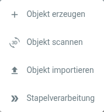

# Artivacts Objekte

## Einführung

Das zentrale Element in Artivact sind die Sammlungsobjekte.

Jedes Objekt in der Sammlung verfügt über eine eigene Seite, die Details und Mediendateien des Objekts enthält.

Objekte können über Widgets gesucht und somit in andere Seiten integriert werden.  
Dies ermöglicht eine flexible Objektauswahl und Seitenorganisation, um deine Sammlung zu verwalten.

Objekte werden über den Objekteinstellungen-Button verwaltet:

Das Menü bietet verschiedene Optionen zur Verwaltung von Objekten:

## Objekt erstellen

Ein Klick auf diesen Menüeintrag erstellt ein neues, leeres Objekt und öffnet direkt den Editor für dieses Objekt.  
Das Objekt wird beim Erstellen automatisch gespeichert.

## Object scannen <Badge type="warning" text="desktop"/>

Führt dieselbe Aktion aus wie "Objekt erstellen", allerdings springt der Objekteditor direkt in den Tab zum Scannen
von Objekten. Dieser Menüeintrag ist eine Abkürzung um beim häufigen Scannen von Sammlungsobjekten Klickarbeit zu
sparen.

## Objekt importieren

Ermöglicht den Import eines zuvor exportierten Objekts.  
Es öffnet sich ein Dialog, in dem die ZIP-Datei des zuvor exportierten Objekts ausgewählt werden kann.

## Stapelverarbeitung

Artivact bietet verschiedene Aktionen, die auf mehrere Objekte gleichzeitig angewendet werden können.
