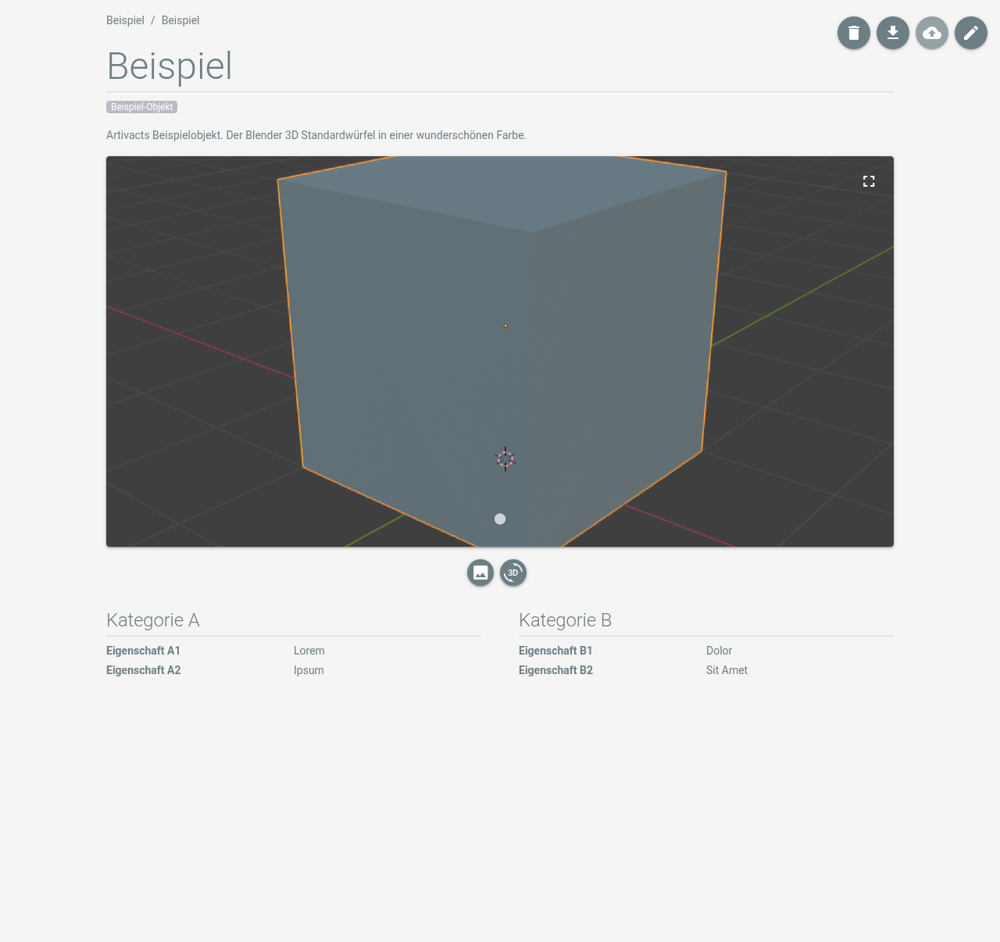

# Objektdetails

## Informationen auf der Detailseite

Beim Öffnen eines Objekts wird die Detailseite des Objekts angezeigt.

Die Detailseite des Objekts besteht aus den folgenden Teilen:

- Kerndaten des Objekts wie Tags oder der Titel und die Beschreibung des Objekts.
- Mediendateien des Objekts wie Bilder und 3D-Modelle.
- Eigenschaften des Objekts, gruppiert in Kategorien.

[Eigenschaften](../settings/properties) sowie [Tags](../settings/tags) können in den Systemeinstellungen definiert
werden.

## Objektaktionen

Die Buttons oben rechts auf der Detailseite bieten folgende Aktionen:

|                                 Button                                  | Beschreibung                                                                                                                                           |
|:-----------------------------------------------------------------------:|:-------------------------------------------------------------------------------------------------------------------------------------------------------|
|      | Löscht das Objekt und alle zugehörigen Dateien.                                                                                                        |
|  | Exportiert das Objekt und seine Mediendateien als ZIP-Datei.                                                                                           |
|          | Synchronisiert das Objekt mit einer entfernten Artivact-Instanz. Nur verfügbar, wenn eine entfernte Instanz in der Austauschkonfiguration gesetzt ist. |
|          | Öffnet den Editor für das Objekt.                                                                                                                      |
