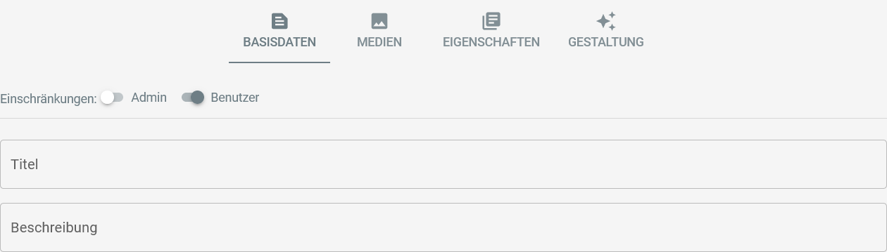
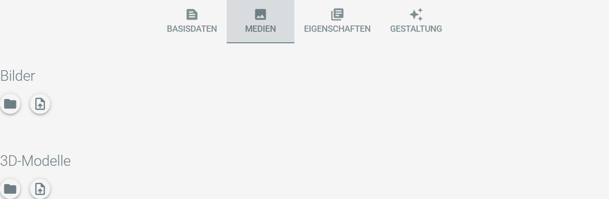

# Editing Items

## The Edit Mode

As user or administrator of the application you can enter the item edit mode by clicking on the button in the upper
right corner of the item's detail page:
TODO

The item details page switches into edit mode and offers new buttons at the top:

|                            Button                             | Description                                       |
|:-------------------------------------------------------------:|:--------------------------------------------------|
|        | Closes item edit mode without saving changes.     |
|  | Exports the item and its media files as ZIP-file. |
|          | Saves the item configuration.                     |

Additionally, a tab bar is displayed in the middle of the page:

The configuration options behind each tab are explained in the sections below.

## Base Data

The base data tab offers the basic configuration for the item:

An item can be restricted to user or administrator access in order to prepare it for publication.

Tags can be added to the tab to further organize your collection items.

The item's title and description can be configured here, too. 

## Media

The media tab lets you manage the item's images and 3D models:

<Badge type="warning" text="desktop"/> The directory button opens the directory in the filesystem containing the media files:

The upload button lets you import images or models from your local filesystem to the item:

Images and models can be ordered by drag-and-drop.

## Properties

The item's properties can be maintained on the properties tab:

Properties are maintained in the system settings, see TODO for details.

## Medien-Gestaltung <Badge type="warning" text="desktop"/>

## Overview

In der Desktop-Variante der Anwendung ist im Bearbeitungsmodus eines Ausstellungsstückes der zusätzliche
Menüpunkt ``Gestaltung`` verfügbar.

Er öffnet die Übersicht zur Medien-Gestaltung:

Die Kernfunktionen, um Artivact als 3D-Scanner zu verwenden, können über folgende Buttons aufgerufen werden:

- Kamera
    - Der Kamera-Knopf öffnet den Dialog, um die Aufnahme von Serienfotos für die 3D-Modell-Erstellung zu öffnen.
      Aufgenommene Fotos werden als Bilder-Sets in der dieser Übersicht angezeigt.
- Schere
    - Der Schere-Knopf eines Bilder-Sets startet das automatische Freistellen aller enthaltenen Bilder.
- Plus
    - Der Plus-Knopf unter ``3D-Modelle`` öffnet die konfigurierte Fotogrammetrie-Software und ein Dateiexplorer-Fenster
      mit den relevanten Bildern.
    - Bilder werden über den Knopf ``Model Input`` als relevant für die Modellerstellung markiert.
- Stift
    - Sobald ein 3D-Modell im OBJ-Format vorliegt, kann übe den Stift-Knopf der konfigurierte 3D-Editor gestartet werden.

## Aufnahmeparameter

Wenn der Kamera-Knopf gedrückt wird, öffnet sich ein Dialog zur Konfiguration der Aufnahmeparameter:

Hier kann die Anzahl der aufzunehmenden Fotos sowie die Nutzung eines Drehtellers konfiguriert werden.
Die Verzögerung bei der Verwendung des Drehtellers wird in Millisekunden angegeben.
Nach der Rotation des automatischen Drehtellers wird erst nach dieser Verzögerung das nächste Foto erstellt.

::: tip Manuelle Rotation
Falls kein automatischer Drehteller verwendet werden soll, kann die konfigurierte Verzögerung genutzt werden, um einen
manuellen Drehteller von Hand, oder auch direkt das Objekt zu rotieren.

Eine Konfiguration von 5000 z.B. sorgt für eine verzögerte Fotoaufnahme von 5 Sekunden, bevor das nächste Foto erstellt wird.
:::

Das automatische Freistellen kann ebenfalls angehakt werden, um schon während der Aufnahmen die Bildhintergründe der
erstellten Fotos automatisch zu entfernen, und so den Gesamtprozess weiter zu beschleunigen.

## Medienübertragung

Nachdem ein 3D-Modell erstellt und als GLTF/GLB exportiert wurde, kann es über die Model-Set-Details für das virtuelle
Ausstellungsstück ausgewählt werden:

Ein Klick auf den Übertragen-Button kopiert das ausgewählte 3D-Modell in die Medienübersicht des Objekts.

::: tip Bilderübertragung
Derselbe Button kann in den Bilder-Set-Details verwendet werden, um aus den Aufnahmen geeignete Bilder für die Medienübersicht des Objekts auszuwählen.
Dies kann verwendet werden, um schnell ein Objektbild für die Übersicht zu erzeugen, bevor später Detailreichere "Produktbilder" erstellt werden.
:::
