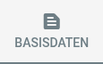
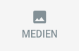
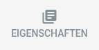
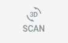
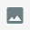

# Objekt-Editor

## Der Bearbeitungsmodus

Ein Benutzer oder Administrator der Anwendung kann den Objekt-Bearbeitungsmodus betreten, indem er auf den Button oben
rechts auf der Detailseite des Objekts klickt:

Die Detailseite des Objekts wechselt in den Bearbeitungsmodus.  
Der nun oben rechts angezeigte Button schließt den Bearbeitungsmodus wieder:

## Editor-Tabs

Im Bearbeitungsmodus werden oben auf der Seite mehrere Tabs angezeigt, die folgende Aktionen bieten:

|                                     Button                                     | Beschreibung                                                                            |
|:------------------------------------------------------------------------------:|:----------------------------------------------------------------------------------------|
|              | Ermöglicht die Bearbeitung der Basisdaten des Objekts wie Titel und Beschreibung.       |
|            | Ermöglicht die Verwaltung der Mediendateien, die dem Objekt zugeordnet sind.            |
|  | Konfiguriert die Eigenschaften des Objekts.                                             |
|      | <Badge type="warning" text="server"/> Ermöglicht das Scannen des Objekts als 3D-Modell. |

Die Konfigurationsmöglichkeiten hinter jedem Tab werden in den folgenden Abschnitten erläutert.

### Basisdaten

Der Basisdaten-Tab bietet die Grundkonfiguration für das Objekt:

| Konfiguration   | Beschreibung                                                                                           |
|:----------------|:-------------------------------------------------------------------------------------------------------|
| Einschränkungen | Der Zugriff auf das Objekt kann auf Administratoren und/oder Benutzer der Anwendung beschränkt werden. |
| Tags            | Tags können dem Objekt zugeordnet werden, um die Verwaltung zu erleichtern.                            |
| Titel           | Der Titel des Objekts kann festgelegt werden.                                                          |
| Beschreibung    | Eine detaillierte Beschreibung des Objekts kann angegeben werden.                                      |

### Medien

Der Medien-Tab ermöglicht die Verwaltung der Bilder und 3D-Modelle des Objekts:

Bilder und Modelle können per Drag & Drop sortiert werden.

### Eigenschaften

Die Eigenschaften des Objekts können im Eigenschaften-Tab gepflegt werden.

Eigenschaften werden in den Systemeinstellungen verwaltet. Siehe [Objekteigenschaften](../settings/properties) für
Details.

## Scannen <Badge type="warning" text="desktop"/>

Auf lokalen Installationen bietet der Erstellungs-Tab die Funktion, Artivact als 3D-Scanner zu nutzen.

Die Übersicht ist zunächst leer und in ``Bilder`` und ``3D-Modelle`` unterteilt.

Die wichtigsten Buttons für das Objektscannen sind:

|                                       Button                                       | Beschreibung                                                                                                                  |
|:----------------------------------------------------------------------------------:|:------------------------------------------------------------------------------------------------------------------------------|
|         | Macht ein Einzelbild mit der angeschlossenen Kamera, das nach Bestätigung direkt als Objektbild gespeichert wird.             |
|           | Nimmt mehrere Bilder des Objekts mit der angeschlossenen Kamera auf und speichert sie als Bildersatz für die spätere Nutzung. |
|  | Erstellt ein neues 3D-Modell mit externer Photogrammetrie-Software.                                                           |

Bilder können mit einer angeschlossenen Kamera aufgenommen werden. Ein automatischer Drehteller kann die Bildaufnahme
zusätzlich beschleunigen.  
Ein aufgenommener Bildsatz wird als ``image set`` bezeichnet. Bildersätze können als Eingabe für die Photogrammetrie
konfiguriert werden.

Nach der Bildaufnahme können 3D-Modelle mit konfigurierter, externer Photogrammetrie-Software erstellt werden.  
Alle für die Modellerstellung ausgewählten Bildersätze werden berücksichtigt.

Einige unterstützte Photogrammetrie-Anwendungen können im Headless-Modus betrieben werden und erstellen das Modell im
Hintergrund.  
Andere unterstützen dies nicht, werden aber von Artivact zusammen mit den vorbereiteten Bildern geöffnet, sodass sie
direkt per Drag & Drop in die Anwendung eingefügt werden können.

::: danger Photogrammetrie-Ergebnisse
Um Objekte zu scannen, müssen Sie zuerst die Konfiguration der Peripheriegeräte von Artivact einrichten.
Siehe [Einstellungen](../settings/peripherals) für Details.
:::::::

Nach der Modellerstellung kann das Ergebnis bei Bedarf mit einem externen Modell-Editor bearbeitet werden.
