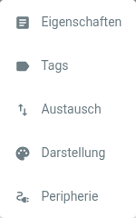

# Artivact-Einstellungen

## Einführung

Artivact bietet verschiedene Konfigurationsoptionen, um z. B. Ihre Sammlung zu definieren oder deren Erscheinungsbild
anzupassen.

Die Einstellungen sind über das Zahnradsymbol in der oberen Leiste zugänglich:

Das geöffnete Menü enthält folgende Einträge:

die folgende Funktionen bieten:

| Eintrag          | Beschreibung                                                                                                                         |
|:-----------------|:-------------------------------------------------------------------------------------------------------------------------------------| 
| Eigenschaften    | Konfiguriert die Eigenschaften, die für jedes Sammlungsobjekt gepflegt werden können.                                                | 
| Schlagworte      | Konfiguriert Schlagworte, die Sammlungsobjekte zu deren Verwaltung oder Auswahl zugewiesen werden können.                            | 
| Exchange         | Konfiguriert eine entfernte Artivact-Instanz für den Upload von Sammlungsobjekten sowie Optionen zum Export und Import der Sammlung. | 
| Erscheinungsbild | Konfiguriert verschiedene Aspekte des Erscheinungsbilds der Anwendung.                                                               | 
| Peripherie       | <Badge type="warning" text="desktop"/> Konfiguriert externe Hard- und Software für das 3D-Scannen von Sammlungsobjekten.             |
