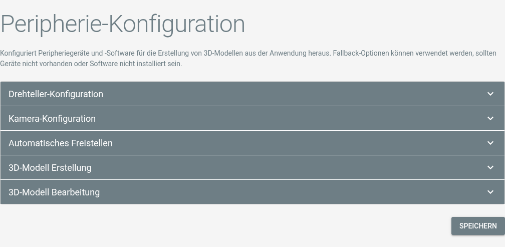

# Peripherie-Konfiguration <Badge type="warning" text="desktop"/>

## Konfiguration

Die Peripherie-Konfiguration fügt Artivact externe Drittanbieter-Software zur Erstellung von 3D-Modellen hinzu.

Sie ist nur in der Desktop-Version verfügbar.

Die Seite zeigt Konfigurationsoptionen für jeden externen Bestandteil der 3D-Modellerstellung:

Durch klick auf "Peripheriegeräte Scannen" versucht Artivact angeschlossene Geräte und installierte Software zu finden,
und Konfigurationen für diese Anzulegen.

## Drehteller

::: warning Linux-Systeme
Linux-Nutzer müssen Mitglied der **dialout**-Gruppe sein, um den Artivact-Drehteller verwenden zu können!
:::

Nach dem Zusammenbau des Drehtellers können Sie ihn über USB mit Ihrem PC verbinden und in Artivact konfigurieren.

|         Auswahl         |    Konfigurationswert    |
|:-----------------------:|:------------------------:| 
| ``Artivact Drehteller`` | Artivacts DIY-Drehteller | 

## Kamera

Für die automatische Bilderfassung müssen Sie Ihre Kamera per USB an den PC anschließen und das Picture Transfer
Protocol (PTP) aktivieren.  
Wenn die Kamera nicht mit dem eingebauten PTP-Adapter funktioniert, können Sie zusätzliche Software installieren,
um sie remote zu steuern.  
Derzeit werden als Fallback [DigiCamControl](https://digicamcontrol.com/) für Windows und [gphoto2](http://gphoto.org/)
für Linux unterstützt.

### DigiCamControl

::: tip Unterstützte Version
Die DigiCamControl-Integration wurde mit Version **2.1** getestet.
:::

| Auswahl            | Konfigurationswert                  | Beispiel                                                       |
|:-------------------|:------------------------------------|:---------------------------------------------------------------|
| ``DigiCamControl`` | Die ausführbare Datei der Anwendung | ``C:/Program Files (x86)/digiCamControl/CameraControlCmd.exe`` |

### gphoto2

::: tip Unterstützte Version
Die gphoto2-Integration wurde mit Version **2.5** getestet.
:::

| Auswahl     | Konfigurationswert                  | Beispiel             |
|:------------|:------------------------------------|:---------------------|
| ``gphoto2`` | Die ausführbare Datei der Anwendung | ``/usr/bin/gphoto2`` |

## Hintergrundentfernung

Artivact kann den Hintergrund aufgenommener Bilder automatisch entfernen.  
Hierfür werden Open-Source-Neuronale Netze zur Erkennung markanter Objekte verwendet. Die Standardkonfiguration liefert
in der Regel akzeptable Ergebnisse.

Für schärfere oder bessere Resultate können neue Netzwerke heruntergeladen, im Projektverzeichnis ``./utils/onnx/``
abgelegt und hier konfiguriert werden.

Das freie Open-Source-Tool [rembg](https://github.com/danielgatis/rembg) von Daniel Gatis bietet eine Sammlung von
Netzwerken sowie einen Vergleich auf seiner GitHub-Seite.

## Modellerstellung

Die Modellerstellung mit Photogrammetrie wird von Artivact über externe Programme unterstützt.

### Meshroom

::: tip Unterstützte Version
Die Meshroom-Integration wurde mit Version **2025.1** getestet.
:::

### Metashape

::: tip Unterstützte Version
Die Metashape-Integration wurde mit Version **2.2** getestet.
:::

### RealityScan

::: tip Unterstützte Version
Die RealityScan-Integration wurde mit Version **2.0** getestet.
:::

## Modelleditor

Die Modellbearbeitung wird von Artivact über eine externe Anwendung unterstützt: Blender 3D.

### Blender 3D

::: tip Unterstützte Version
Die Blender-Integration wurde mit den Versionen **4.5** und **5.0** getestet.
:::

Für die Modellbearbeitung kann Blender 3D direkt aus Artivact gestartet werden.  
Das ausgewählte Modell-Set, das ein OBJ-3D-Modell aus den vorherigen Schritten enthält, wird automatisch importiert.

Das finale 3D-Modell sollte als GLTF/GLB-Datei in den von Blender vorgeschlagenen Standardordner exportiert
