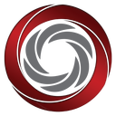
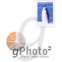
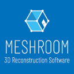
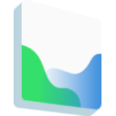

# Artivact as Desktop Application

## About

The core feature of Artivact on the Desktop is to create 3D models of your items using third party tools like
photogrammetry software.

The process of model creation usually involves the following steps:

- Creating lots of images of the item from different perspectives.
- Copying the images from your camera to your PC.
- Using the photos in a photogrammetry tool to create a 3D model.
- Sometimes editing the result in a model editor to finish it.
- Export the model in the desired format.

Artivact allows you to configure third party programs as well as a camera setup to speed up the whole process from
picture taking to model creation and export drastically.

## Features

Using photogrammetry to create digital twins of real life items is a time-consuming and tedious task.
It often leads to a ton of different files and directories in the filesystem and one can lose track of the progress
easily.

The desktop application addresses these problems and provides the following features:

- Easy and fast creation of 3D models by combining different tools in the process of model creation.
- Flexible options to organize your collection and keep track of every virtual item.
- Export of created items and their media files in a standard ZIP format.

## Third Party Software

Artivact itself is no photogrammetry software. It provides a frontend for different tools required in the process,
without hiding them from the user. The user remains in full control of the tools used, but gets support in handling
them.

The following software is currently supported.

### Image Creation & Manipulation

For automatic image creation using your PC the following software can be used from within Artivact:
| Windows | Linux |
| :-------------: | :-----------: |
| [DigiCamControl](https://digicamcontrol.com/)  | [gphoto2](http://gphoto.org/) |

In order to create full 3D models it might be necessary to remove the background from images. To automate this, the
following tool can be used:
| Windows & Linux |
| :-------------: |
| [Rembg](https://github.com/danielgatis/rembg) |

### Model Creation

The following photogrammetry tools are supported by Artivact. They are started from within the program, but must be
operated by the user manually:
| Windows & Linux | Windows & Linux |
| :-------------: | :-----------: |
| [Meshroom](https://alicevision.org/#meshroom)  | [Metashape](https://www.agisoft.com/) |

### Model Editing

To edit the resulting 3D model the following tool can be used:
| Windows & Linux | 
| :-------------: | 
| [Blender 3D](https://www.blender.org/)  |
