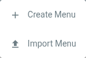

# Menus

## Menu Management

You can add menus by left-clicking on the following button in the top bar:

Menus can only be added with the default locale selected!

A menu opens, offering the following options:

| Option      | Description                                           |
|:------------|:------------------------------------------------------|
| Create Menu | Opens a dialog to create a new menu.                  |
| Import Menu | Imports a previously exported menu into the menu bar. |

The dialog for creating/editing a menu offers the following options:

| Option            | Description                                                                                                                                                                            |
|:------------------|:---------------------------------------------------------------------------------------------------------------------------------------------------------------------------------------|
| Menu              | The menu's name which is shown in the menu bar.                                                                                                                                        |
| Restrictions      | Menus can be restricted to administrators and/or users. The menu is not shown unless the authenticated user has the proper role.                                                       |
| External Page URL | A menu can point to an external URL instead of a page.                                                                                                                                 |
| External Page URL | A menu can point to an external URL instead of a page.                                                                                                                                 |
| URL Alias         | When a menu points to an Artivact page, and not an external URL, an alias can be defined. The alias can be used in the browser's URL instead of the page's ID to navigate to the page. |
| URL Alias         | When a menu points to an Artivact page, and not an external URL, an alias can be defined. The alias can be used in the browser's URL instead of the page's ID to navigate to the page. |
| Hidden Menu       | A menu and its associated page can be made publicly available, i.e. without any restrictions, but hidden from the menu bar with this option.                                           |

By right-clicking on the menu a context menu opens, which offers the following options:

| Option        | Description                                                                                                           |
|:--------------|:----------------------------------------------------------------------------------------------------------------------|
| Edit Menu     | Opens the menu dialog and lets you change the menu's name or restrictions.                                            |
| Delete Menu   | Deletes the menu and all its entries and associated pages!                                                            |
| Add Page      | Adds a page to the menu. When left-clicking the menu, the page will open directly.                                    |
| Add Entry     | Adds an entry to the menu. When left-clicking the menu, it will open and show its menu entries.                       |
| Export Menu   | Exports the menu's pages and their content including items with media files into the project's ``exports`` directory. |
| Relocate Menu | Opens a dialog to move the menu into another menu.                                                                    |
| Move Left     | Moves the menu one step to the left.                                                                                  |
| Move Right    | Moves the menu one step to the right.                                                                                 |

## Menu Entries

Menus can have entries.
When adding an entry to a menu, the same dialog as the one for menus opens, and a menu entry name and restrictions can
be specified.

When right-clicking on an existing menu entry, a context menu opens, which offers the following options:

| Option              | Description                                                                                                        |
|:--------------------|:-------------------------------------------------------------------------------------------------------------------|
| Edit Menu Entry     | Opens the menu entry dialog and lets you change the menu entry's name or restrictions.                             |
| Delete Menu Entry   | Deletes the menu entry and its associated page!                                                                    |
| Export Content      | Exports the menu's page and its content including items with media files into the project's ``exports`` directory. |
| Relocate Menu Entry | Opens a dialog to move the menu entry into another menu or the main menu.                                          |
| Move Up             | Moves the menu entry one step up.                                                                                  |
| Move Down           | Moves the menu one step down.                                                                                      |
