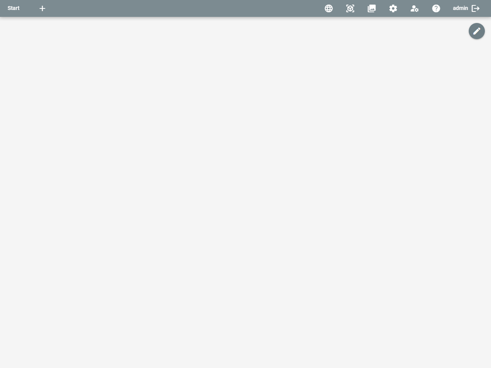
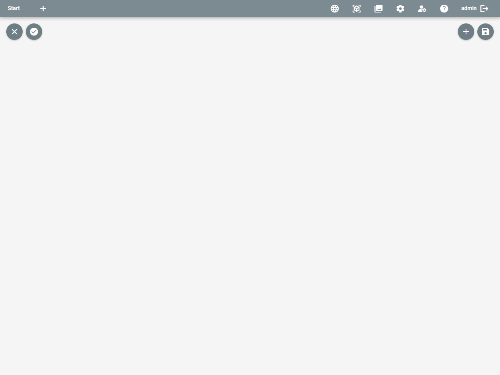
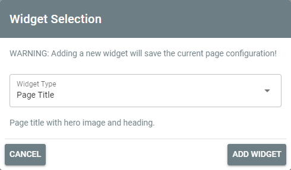
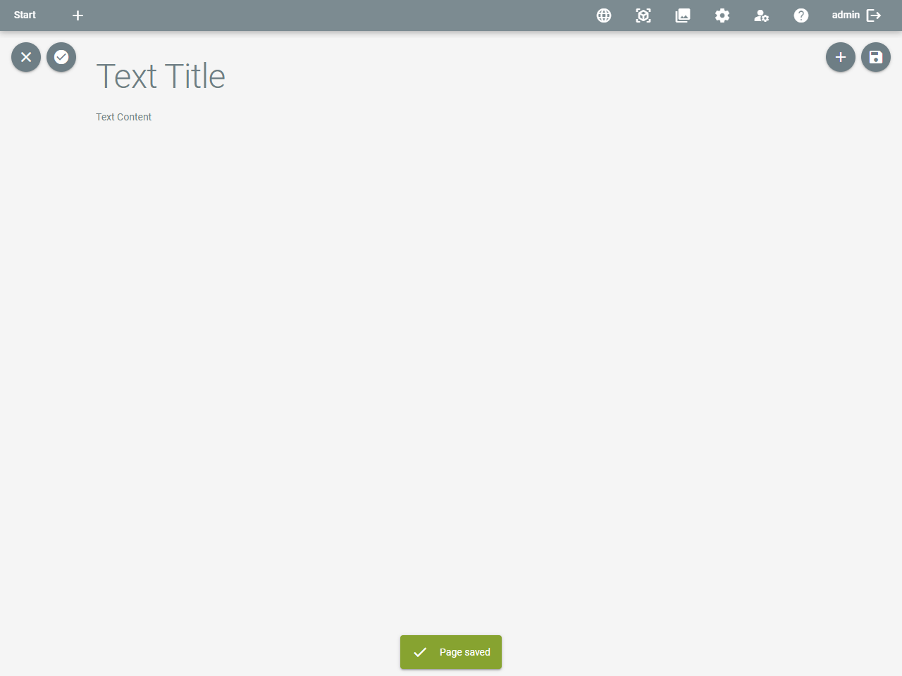
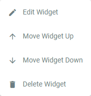
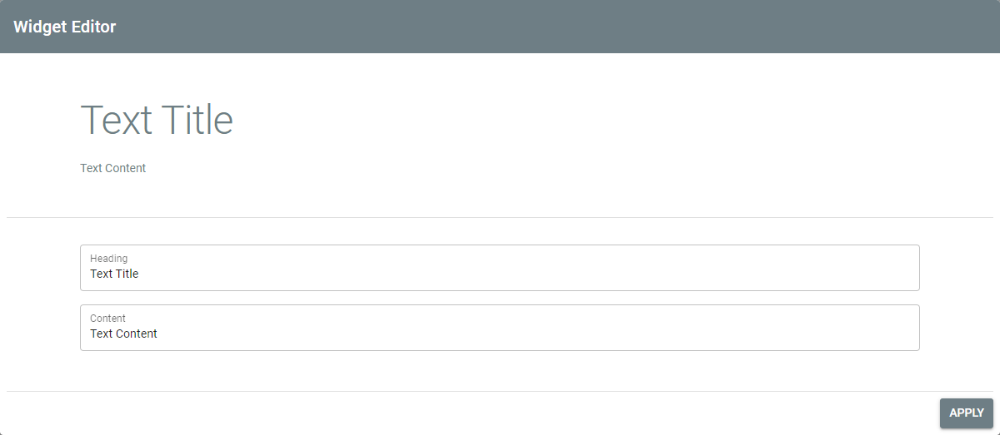

# Pages

## Page Mode

After adding a page to a menu or menu entry, it can be opened by clicking on the menu (or menu entry).

Newly created pages are empty.

By clicking on the edit button in the top right, which is only shown to administrators and users, you can switch to page
edit mode:

## Edit Mode

### General Options

In edit mode, new buttons are shown at the top of the page:

The buttons offer the following functionality:

|                              Button                              | Description                                                                        |
|:----------------------------------------------------------------:|:-----------------------------------------------------------------------------------|
|            | Closes page edit mode without saving changes.                                      |
|  | Defines this page as index page, which is loaded if no specific page is requested. |
|  | Opens the dialog to add a widget to the page.                                      |
|              | Saves the current page configuration.                                              |

### Adding Widgets

Widgets are added by clicking the respective button. A dialog opens and provides a selection of available widgets:

Available widgets are:

| Widget         | Description                                                                                                                |
|:---------------|:---------------------------------------------------------------------------------------------------------------------------|
| Page Title     | A page title spanning an optional image across the browser windows and a bold, central title text.                         |
| Text           | A heading with text content. Markdown is supported to further structure and format the text content.                       |
| Image and Text | A two column widget with an image on the left and a heading with text content on the right.                                |
| Item Search    | A widget providing input for an item search. If a search term is configured, the search result will directly be displayed. |
| Item Carousel  | A widget showing items from an item search in a carousel. The search term must be configured.                              |
| Info Box       | An info box containing a heading and text content. Can be colored in green, red and yellow.                                |
| Avatar         | A central image, rounded, with an optional subtext.                                                                        |
| Space          | A widget to add extra space between two other widgets.                                                                     |

### Editing Widgets

After adding a widget, it is displayed on the page:

By hovering the widget with the mouse and right-clicking on it, a context menu to edit the widget is opened

with the following options:

| Option           | Description                                                                                       |
|:-----------------|:--------------------------------------------------------------------------------------------------|
| Edit Widget      | Opens a modal to configure the widget.                                                            |
| Move Widget Up   | Moves the widget up one place.                                                                    |
| Move Widget Down | Moves the widget down one place.                                                                  |
| Delete Widget    | Deletes the widget directly (!) from the page. The widget is NOT deleted until the page is saved. |

The modal to configure a widget is split into to parts. The upper part is a preview of the results, the lower part
provides configuration options for the widget, depending on the type of the widget.

As an example, here is the text widget's modal:

When clicking the ``Apply`` button, the changes are taken over to the page and the modal closes.