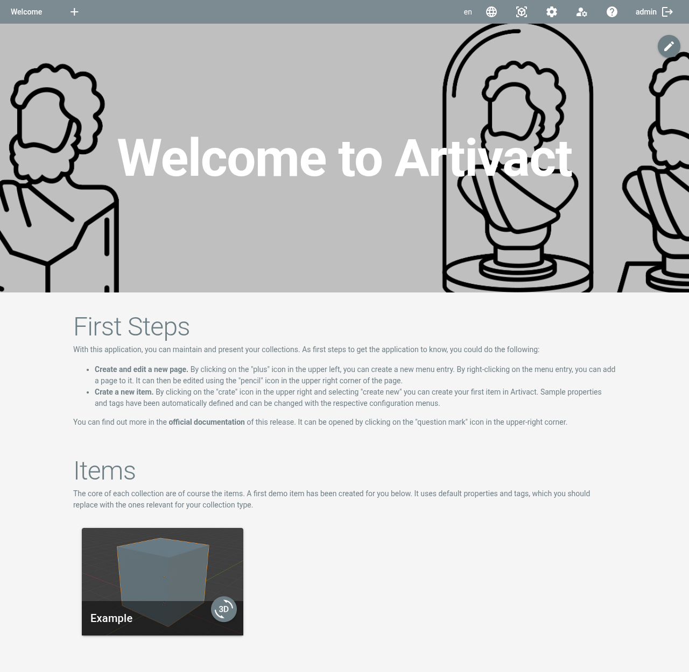

# Artivact User Manual

## About

The Artivact user manual documents how to use the application to create and manage your virtual collections.

The desktop and web server variant of the application differ slightly in their feature sets.
If a function only applies to one of the installation variants, this will be denoted in the documentation by one of the
following badges:

- <Badge type="warning" text="server"/> - This functionality is only available, if Artivact is run in web server mode.
- <Badge type="warning" text="desktop"/> - This functionality is only available, if Artivact is started on your local computer.

## The Main Screen

After first start, the main screen is shown to the user.
<Badge type="warning" text="desktop"/> In desktop mode, this is the default welcome page.

At the top is the navigation and settings bar.
The following functions are available from left to right:

|                                 Button                                 | Description                                                                                                                                            |
|:----------------------------------------------------------------------:|:-------------------------------------------------------------------------------------------------------------------------------------------------------|
|                  | Adds a new menu to the top navigation. See [Menus](../content-management/menus) for details.                                                           |
|  | Selects the locale for internationalization (I18N). See [I18N](../content-management/internationalization) for details.                                |
|         | Opens the items menu. From there you can create new items or import existing ones. See [Item Management](../item-management/introduction) for details. |
|    | Opens the system settings menu. See [System Settings](../settings/properties) for details.                                                             |
|  | <Badge type="warning" text="server"/> Opens the account settings menu. See [Account Management](../account-management/accounts) for details.           |
|        | Opens this documentation from within the application.                                                                                                  |
|                      | <Badge type="warning" text="server"/> Logs the user out of the application.                                                                            |
|                        | <Badge type="warning" text="server"/> Opens the login page.                                                                                            |

You can use the plus button to add a new menu entry and define a page as described in the next chapter.