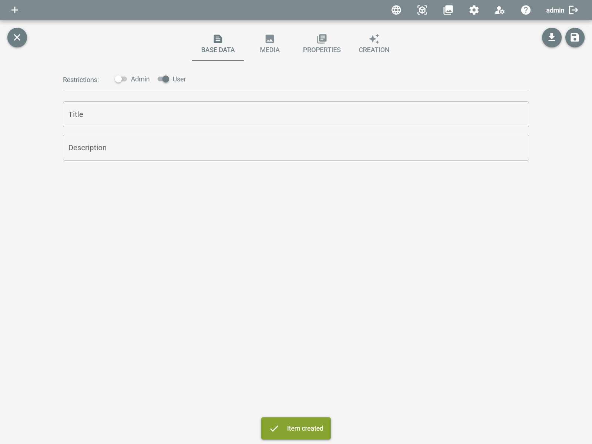
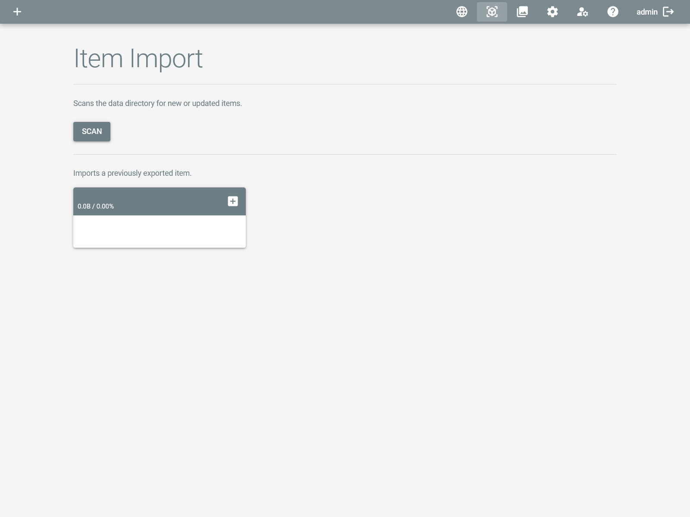

# Artivact's Items

## Introduction

The core piece of information in Artivact are the collection items.

Every item in the collection has its own page containing details and media files of the item.

Items can be searched by widgets and thus be integrated into other pages.
This enables flexible item selection and page orchestration to manage your collection.

## Creating Items

You can create new items by clicking on the item settings button:

and choosing the ``Create Item`` menu entry.

A new, empty item will be created and the item details page jumps directly into edit mode.

You can now start entering item data or adding media files, as described in the [Item Editing](./item-editing.md) section of the manual.

## Importing Items

You can import previously exported items by clicking on the item settings button:

and choosing the ``Import Items`` menu entry.

There are two options available on the then opened page:

- A click on the ``Scan`` button starts scanning the ``items`` directory in the project folder for any items that have not yet been imported.
- A previously exported item's ZIP-file can be uploaded and imported with the file upload option.
