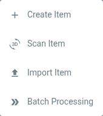

# Artivact's Items

## Introduction

The core piece of information in Artivact are the collection items.

Every item in the collection has its own page containing details and media files of the item.

Items can be searched by widgets and thus be integrated into other pages.
This enables flexible item selection and page orchestration to manage your collection.

Items are managed using the item settings button:

The menu offers different options to manage items:

## Create Item

Clicking this menu entry creates a new, empty item and jumps directly into the editor for this item.
The item is saved automatically when created.

## Scan Item <Badge type="warning" text="desktop"/>

Same as 'Create Item' above, but the item editor jumps into the tab for scanning directly. It is a shortcut to save a
few clicks when scanning a new item.

## Import Item

Lets you import a previously exported item. A dialog will pop up that let's you choose the ZIP file of the previously
exported item.

## Batch Processing

Artivact offers different actions to perform on multiple Items.