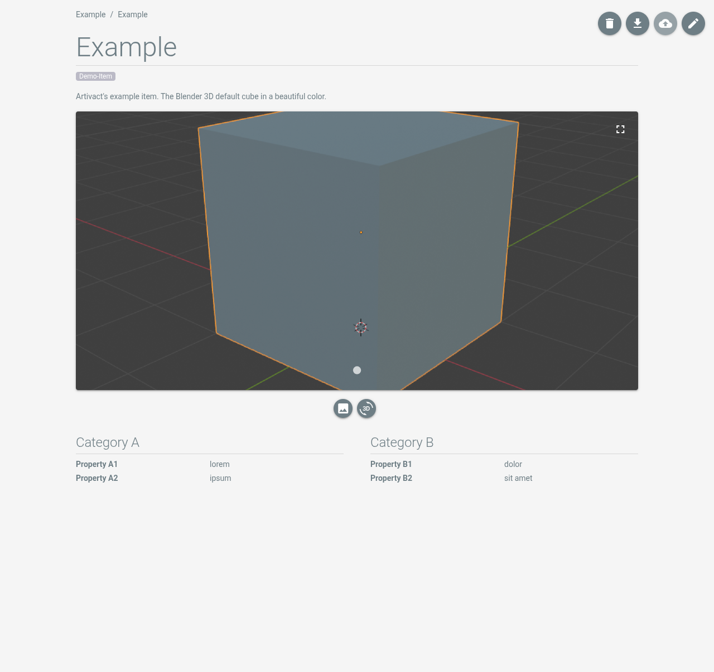

# Item Details

## Information on the Details Page

When opening an item, the item details page is shown.

The item details page consists of the following parts:

- Core item data like tags or the item's title and description.
- Item media files like images and 3D models.
- Item properties, grouped in categories.

[Properties](../settings/properties), as well as [tags](../settings/tags), can be defined in the system settings.

## Item Actions

The buttons in the top right of the details page offer the following actions:

|                                 Button                                  | Description                                                                                                                      |
|:-----------------------------------------------------------------------:|:---------------------------------------------------------------------------------------------------------------------------------|
|      | Deletes the item and all its associated files.                                                                                   |
|  | Exports the item and its media files as ZIP-file.                                                                                |
|          | Synchronizes the item with a remote Artivact instance. Only available if a remote instance is set in the exchange configuration. |
|          | Opens the item's editor.                                                                                                         |
