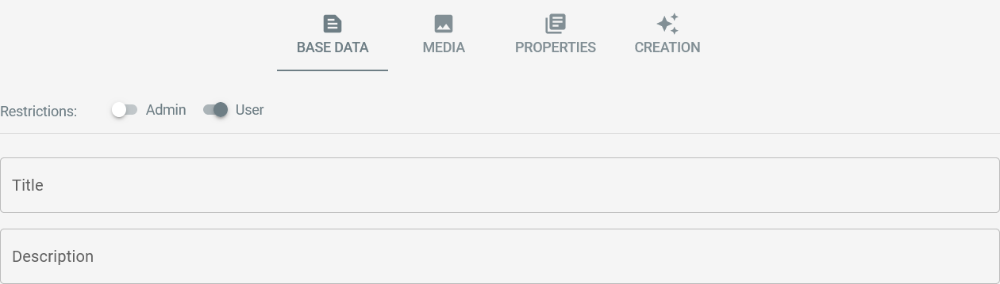
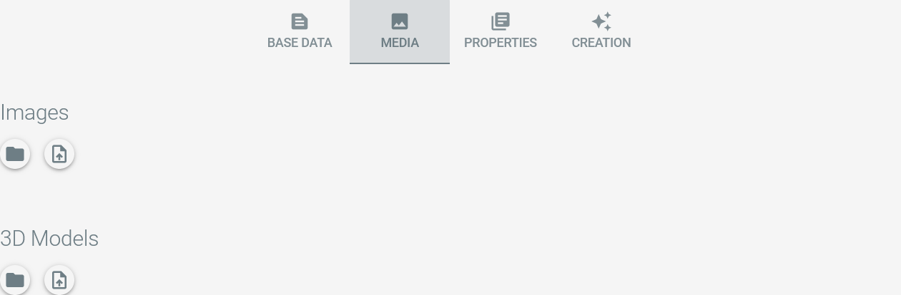
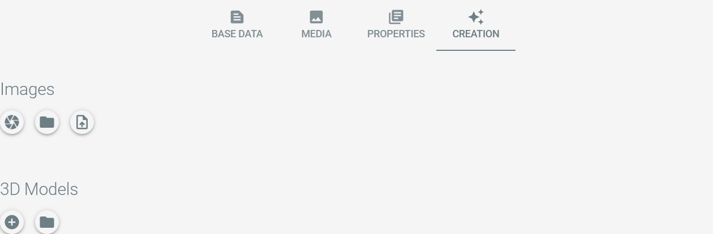

# Editing Items

## The Edit Mode

As user or administrator of the application you can enter the item edit mode by clicking on the button in the upper
right corner of the item's detail page:
TODO

The item details page switches into edit mode and offers new buttons at the top:

|                            Button                             | Description                                       |
|:-------------------------------------------------------------:|:--------------------------------------------------|
|        | Closes item edit mode without saving changes.     |
|  | Exports the item and its media files as ZIP-file. |
|          | Saves the item configuration.                     |

Additionally, a tab bar is displayed in the middle of the page:

The configuration options behind each tab are explained in the sections below.

## Base Data

The base data tab offers the basic configuration for the item:

An item can be restricted to user or administrator access in order to prepare it for publication.

Tags can be added to the tab to further organize your collection items.

The item's title and description can be configured here, too. 

## Media

The media tab lets you manage the item's images and 3D models:

<Badge type="warning" text="desktop"/> The directory button opens the directory in the filesystem containing the media files:

The upload button lets you import images or models from your local filesystem to the item:

Images and models can be ordered by drag-and-drop.

## Properties

The item's properties can be maintained on the properties tab:

Properties are maintained in the system settings, see TODO for details.

## Creation <Badge type="warning" text="desktop"/>

### Overview

On local installations, the creation tab offers the functionality to use Artivact as 3D-Scanner. 

The overview is initially empty.

The camera button lets you capture images from an attached camera:

It opens the dialog to capture images for model creation. Captured images are shown as image-set in
the images overview. 

The plus button lets you create 3D models from those image-sets:

It opens the configured photogrammetry software and a file explorer window containing the relevant images.
Images are selected as relevant if ``Model Input`` in the respective image-set is selected.

By capturing images and creating 3D models from them, the tab is filled and eventually looks like this example:

Additional buttons to use Artivact as a 3D scanner application are:
 
- Scissors
    - The scissors button on an image-set starts the automatic removal of image backgrounds if clicked.
- Pencil
    - Once an OBJ file has been created with photogrammetry, the pencil button of a model-set will open the configured
      3D modelling tool.

### Photo-Capture Parameters

When the camera button is clicked, a dialog with configuration parameters for image capturing will appear:

Here the number of photos that should be taken can be configured as well as the usage of an automatic turntable.

::: tip Manual Turntables
If no automatic turntable is used, the configurable delay in milliseconds can be used to manually rotate the object.

E.g. a delay configuration value of 5000 will give you five seconds to rotate the object, before the next image is
captured.
:::

Automatic image background removal can be checked to remove the image backgrounds during image capturing to speed up
the process.

### Media Transfer

After finishing model creation and exporting it as GLTF/GLB file, it can be transferred to the item's media section
using the model-set details view:

A click on the transfer button will copy the model to the items media section.
From then on the model is visible on the item.

::: tip Image Transfer
The same button is available in the image-set details view. This is a quick way to create a first image for the item
before capturing better "product" images later.
:::
