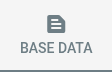
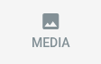
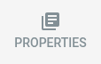
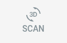
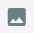

# Item Editor

## The Edit Mode

A user or administrator of the application can enter the item edit mode by clicking on the button in the upper
right corner of the item's detail page:

The item details page switches into edit mode. The now shown button on the top right closes the edit mode again:

## Editor Tabs

In edit mode, several tabs are shown at the top of the page which offer the following actions:

|                                     Button                                     | Description                                                               |
|:------------------------------------------------------------------------------:|:--------------------------------------------------------------------------|
|              | Lets you edit the base data of the item like title and description.       |
|            | Lets you manage media files associated with the item.                     |
|  | Configures the item's properties.                                         |
|      | <Badge type="warning" text="server"/> Lets you scan the item as 3D model. |

The configuration options behind each tab are explained in the sections below.

### Base Data

The base data tab offers the basic configuration for the item:

| Configuration | Description                                                                             |
|:--------------|:----------------------------------------------------------------------------------------|
| Restrictions  | Access to the item can be restricted to administrators and/or users of the application. |
| Tags          | Tags can be associated with the item to better support item management.                 |
| Title         | The item's title can be set.                                                            |
| Description   | A detailed description of the item can be set.                                          |

### Media

The media tab lets you manage the item's images and 3D models:

Images and models can be ordered by drag-and-drop.

### Properties

The item's properties can be maintained on the properties tab.

Properties are maintained in the system settings, see [Item Properties](../settings/properties) for details.

## Scan <Badge type="warning" text="desktop"/>

On local installations, the creation tab offers the functionality to use Artivact as 3D-Scanner.

The overview is initially empty and separated into ``Images`` and ``3D Models``.

The most important buttons for item scanning are:

|                                       Button                                       | Description                                                                                                  |
|:----------------------------------------------------------------------------------:|:-------------------------------------------------------------------------------------------------------------|
|         | Takes a single picture with the attached camera, which is, upon approval, directly saved as an item picture. |
|           | Captures multiple images of the item with an attached camera and saves them as image set for future use.     |
|  | Creates a new 3D model using external photogrammetry softare.                                                |

Images can be captured with an attached camera. An automated turntable can be used to further speed up image capturing.
A captured set of images is referred to as ``image set``. Image sets can be configured to serve as input for
photogrammetry.

After capturing images, 3D models can then be created using configured, external photogrammetry software.
All image sets selected for model creation are taken into account.

Some of the supported photogrammetry applications can be used in headless mode and create the model in the background.
Others don't support this, but will be opened by Artivact together with the prepared images to directly drag&drop them
into the application.

::: danger Photogrammetry Results
The created 3D model is expected to be in OBJ format and exported to Artivact's project folder into the directory:
``./temp/export/``.
Using the default configurations provided by Artivact, this should automatically be the case.
:::

After model creation, the result can be edited with an external model editor if necessary.