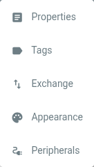

# Artivact's Settings

## Introduction

Artivact offers multiple configuration options to e.g. define your collection or customize its appearance.

Settings are available by clicking the cog icon in the top bar:

The opened menu contains the following items:

which offer the following functionality:

| Entry       | Description                                                                                                   |
|:------------|:--------------------------------------------------------------------------------------------------------------| 
| Properties  | Configures the properties that can be maintained for every item.                                              | 
| Tags        | Configures tags that can be assigned to items for item management or selection.                               | 
| Exchange    | Configures a remote Artivact instance for item upload as well as options to export and import the collection. | 
| Appearance  | Configures various aspects of the application's appearance.                                                   | 
| Peripherals | <Badge type="warning" text="desktop"/> Configures external hard- and software for 3D scanning of items.       | 
