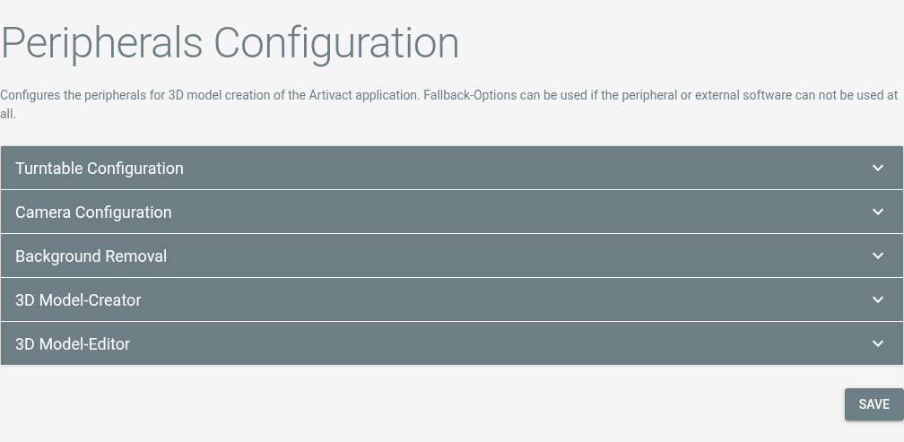

# Peripherals Configuration <Badge type="warning" text="desktop"/>

## Configuration

Peripheral configuration adds the external 3rd party software to create 3D models to Artivact.

It is only available in the desktop version.

The page shows configuration options for every external part of 3D model creation:

## Turntable

::: warning Linux Systems
Linux users have to be in the **dialout** group in order to use the Artivact turntable!
:::

After assembly of the turntable, you can connect it to your PC via USB and configure it in Artivact.

|       Selection        |   Configuration Value    |
|:----------------------:|:------------------------:| 
| ``Artivact Turntable`` | Artivact's DIY turntable | 

## Camera

For automatic image capturing, you need to attach your camera to your PC using USB and enable Picture Transfer
Protocol (PTP) on it.
If the camera is not working with the builtin default connector, you and install additional Software to control it
remotely. Currently, [DigiCamControl](https://digicamcontrol.com/) for Windows systems and [gphoto2](http://gphoto.org/)
for Linux systems are supported as fallback.

### DigiCamControl

::: tip Supported Version
DigiCamControl integration has been tested for Version **2.1**.
:::

| Selection          | Configuration Value          | Example                                                        |
|:-------------------|:-----------------------------|:---------------------------------------------------------------|
| ``DigiCamControl`` | The application's executable | ``C:/Program Files (x86)/digiCamControl/CameraControlCmd.exe`` |

### gphoto2

::: tip Supported Version
gphoto2 integration has been tested for Version **2.5**.
:::

| Selection   | Configuration Value          | Example              |
|:------------|:-----------------------------|:---------------------|
| ``gphoto2`` | The application's executable | ``/usr/bin/gphoto2`` |

## Background Removal

Artivact can automatically remove the background of captured images. For this, open-source neural networks for
salient object detection are used. The default configuration should provide acceptable results.

If sharper / better results are needed, you can download new networks, place them in the project's ``./utils/onnx/``
directory and configure their parameters here.

The free and open-source tool [rembg](https://github.com/danielgatis/rembg) by Daniel Gatis offers a collection of
networks and a comparison of them on his project's Github page.

## Model Creator

Model creation with photogrammetry is supported by Artivact through external programs.

### Meshroom

::: tip Supported Version
Meshroom integration has been tested for Version **2025.1**.
:::

### Metashape

::: tip Supported Version
Metashape integration has been tested for Version **2.2**
:::

### RealityScan

::: tip Supported Version
RealityScan integration has been tested for Version **2.0**
:::

## Model Editor

Model editing is supported by Artivact through an external application: Blender 3D.

### Blender 3D

::: tip Supported Version
Blender integration has been tested for Versions **4**.
:::

For model editing, Blender 3D can be opened from within Artivact.
The selected model-set, containing an OBJ 3D model from the previous steps, will automatically be imported.

The final 3D model should be exported as GLTF/GLB file into the default folder suggested by Blender.

It can then finally be transferred to the virtual items media section and used from there on.
